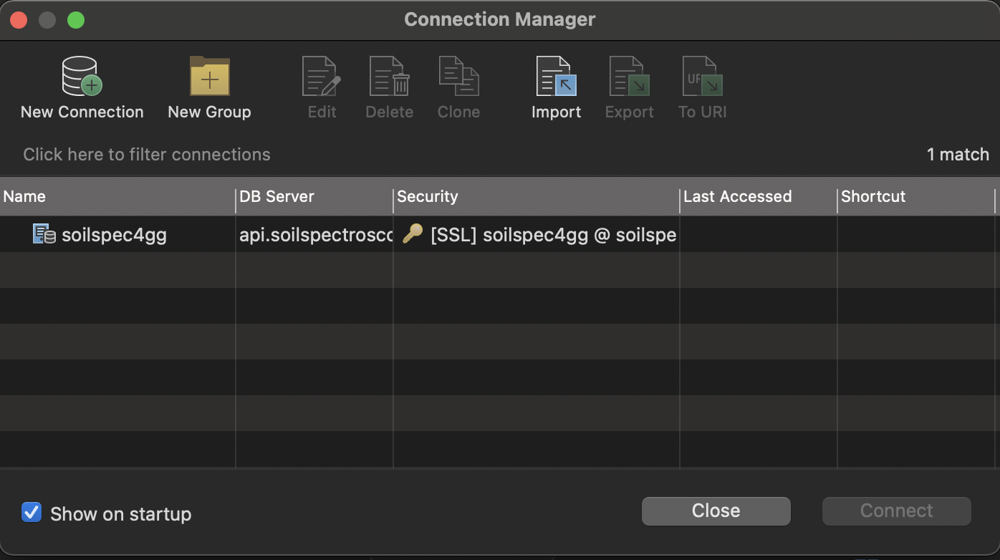

# Soil Data Research

## A Global Good Project

> Posted on [Hackers News](https://news.ycombinator.com/item?id=32293359)

<!------------------------------------------------->
<!-- image                                       -->
<!------------------------------------------------->

The Open Soil Spectral Library (OSSL) is a global good project which serves collection of soil properties derived from spectral data. OSSL is also a network that delivers robust statistical models specifically calibration and predictions models, research tools, and oportiunities to colaborate across borders.

The OSSL project offers a beautifully developed software: [OSSL Explorer](https://explorer.soilspectroscopy.org/) and a user manual: [OSSL manual](https://soilspectroscopy.github.io/ossl-manual/).

<!------------------------------------------------->
<!-- image                                       -->
<!------------------------------------------------->

The initiative is funded through the National Institute of Food and Agriculture (USDA).
[NIFA](https://www.nifa.usda.gov/about-nifa/press-releases/nifa-invests-over-7-million-big-data-artificial-intelligence-other) has invested over $7 Million in Big Data, Artificial Intelligence, and Other Cyberinformatics Research.

# What is Soil Data Research?

Visible and near infraread light [VIS-NIR](https://www.sciencedirect.com/topics/agricultural-and-biological-sciences/reflectance-spectroscopy#:~:text=NEAR%2DINFRARED%20REFLECTANCE%20SPECTROSCOPY%20ANALYSIS,%2C%20energy%2C%20and%20mineral%20content.)

<!------------------------------------------------->
<!-- image                                       -->
<!------------------------------------------------->

The reflected infrared radiation is converted to electrical energy and fed to a computer for interpretation. Each major organic component of the soil absorbs and reflects visible, near-infrared light, and mid-infrared light differently. By measuring these different reflectance characteristics, the Spectroradiometer and a computer determine the quantity of these components in the soil sample.

<!------------------------------------------------->
<!-- image                                       -->
<!------------------------------------------------->

<!------------------------------------------------->
<!-- image                                       -->
<!------------------------------------------------->

Spectral signature picked up from the Spectroradiometer(SRM) during . See the thikcer red arrow

# Why It is needed?

1. Monitoring and predicting soil properties
1. Health System Thinking:
   > `Microbiome ⭌ Soil ⭌ Plants ⭌ Plant-based diet ⭌ Human Microbiomes ⭌ Longevity ⭌ Synchronize with natural`
1. Data Science
1. The miccrobiome of the soil, food, agriculture and human microbiomes are linked.

# How to download the Open Soil Spectracl Library (OSSL)?

The OSSL manual mentioned two ways to access the data. The firt method is using MongoDb via R; however, the last yields a certification error. See image below:

<!------------------------------------------------->
<!-- image                                       -->
<!------------------------------------------------->

Thus, we use the second method to access the data which uses Studio 3T and the following parameters:

- Name: soilspec4gg
- Address: api.soilspectroscopy.org
- Database: soilspec4gg
- Username: soilspec4gg
- Password: soilspec4gg

Step 1: Free download [Studio 3T](https://robomongo.org/) and complete installation.

Step 2: In Studio 3T,

- click on the New Collection icon:
  <!------------------------------------------------->
  <!-- image                                       -->
  <!------------------------------------------------->

  

- select the `manually configure my connection setting` option
  <!------------------------------------------------->
  <!-- image                                       -->
  <!------------------------------------------------->
  
- Fill in the Connection name: `soilspec4gg` and, in the `Server` tab, fill with OSSL's given address: `api.soilspectroscopy.org`
  <!------------------------------------------------->
  <!-- image                                       -->
  <!------------------------------------------------->

  

- Go to the Authentication tab and select Basic Authentication Mode:
   <!------------------------------------------------->
   <!-- image                                       -->
   <!------------------------------------------------->

  

  - Fill in the User name, Password and Authentication DB with `soilspec4gg`
    <!------------------------------------------------->
     <!-- image                                       -->
     <!------------------------------------------------->
    

- Under the SSL tab, select `Use SSL protocol to connect` and `accept any server SSL certificates`
  <!------------------------------------------------->
  <!-- image                                       -->
  <!------------------------------------------------->

  

- Test Connection before saving:
  <!------------------------------------------------->
  <!-- image                                       -->
  <!------------------------------------------------->

  

- Finally, click save and connect.
    <!------------------------------------------------->
    <!-- image                                       -->
    <!------------------------------------------------->

  
  
  Open a terminal and install Base R on OSX

- Connection Name: `soilspec4gg`
- Server: `api.soilspectroscopy.org`
- Authentication DB: `soilspec4gg`
- User name: `soilspec4gg`
- Password: `soilspec4gg`
- Use SSL: `true`
- Accept any SSL certificates: `true`

    <!------------------------------------------------->
    <!------------------------------------------------->

  ***

    <!------------------------------------------------->
