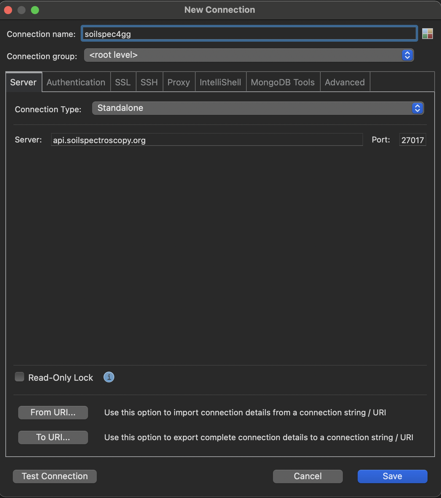
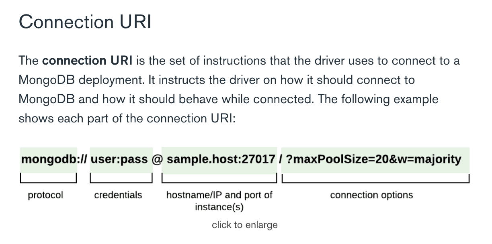

# Soil Data Research

## A Global Good Project

> Posted on [Hackers News](https://news.ycombinator.com/item?id=32293359)

<!------------------------------------------------->
<!-- image                                       -->
<!------------------------------------------------->


The Open Soil Spectral Library (OSSL) is a global good project which serves collection of soil properties derived from spectral data. OSSL is also a network that delivers robust statistical models specifically calibration and predictions models, research tools, and oportiunities to colaborate across borders.

The OSSL project offers a beautifully developed software: [OSSL Explorer](https://explorer.soilspectroscopy.org/) and a user manual: [OSSL manual](https://soilspectroscopy.github.io/ossl-manual/).

<!------------------------------------------------->
<!-- image                                       -->
<!------------------------------------------------->


The initiative is funded through the National Institute of Food and Agriculture (USDA).
[NIFA](https://www.nifa.usda.gov/about-nifa/press-releases/nifa-invests-over-7-million-big-data-artificial-intelligence-other) has invested over $7 Million in Big Data, Artificial Intelligence, and Other Cyberinformatics Research.

# What is Soil Data Research?

Visible and near infraread light [VIS-NIR](https://www.sciencedirect.com/topics/agricultural-and-biological-sciences/reflectance-spectroscopy#:~:text=NEAR%2DINFRARED%20REFLECTANCE%20SPECTROSCOPY%20ANALYSIS,%2C%20energy%2C%20and%20mineral%20content.)

<!------------------------------------------------->
<!-- image                                       -->
<!------------------------------------------------->


The reflected infrared radiation is converted to electrical energy and fed to a computer for interpretation. Each major organic component of the soil absorbs and reflects visible, near-infrared light, and mid-infrared light differently. By measuring these different reflectance characteristics, the Spectroradiometer and a computer determine the quantity of these components in the soil sample.

<!------------------------------------------------->
<!-- image                                       -->
<!------------------------------------------------->


<!------------------------------------------------->
<!-- image                                       -->
<!------------------------------------------------->


Spectral signature picked up from the Spectroradiometer(SRM) during . See the thikcer red arrow

# Why It is needed?

1. Monitoring and predicting soil properties
1. Health System Thinking:
   > `Microbiome ⭌ Soil ⭌ Plants ⭌ Plant-based diet ⭌ Human Microbiomes ⭌ Longevity ⭌ Synchronize with natural`
1. Data Science
1. The miccrobiome of the soil, food, agriculture and human microbiomes are linked.

# How to download the Open Soil Spectracl Library (OSSL)?

The OSSL manual mentioned two ways to access the data. The firt method is using MongoDb via R; however, the last yields a certification error. See image below:

<!------------------------------------------------->
<!-- image                                       -->
<!------------------------------------------------->


Thus, we use the second method to access the data which uses Studio 3T and the following parameters:

- Name: soilspec4gg
- Address: api.soilspectroscopy.org
- Database: soilspec4gg
- Username: soilspec4gg
- Password: soilspec4gg

Step 1: Free download [Studio 3T](https://robomongo.org/) and complete installation.

Step 2: In Studio 3T,

- click on the New Collection icon:
  <!------------------------------------------------->
  <!-- image                                       -->
  <!------------------------------------------------->

  

- select the `manually configure my connection setting` option
  <!------------------------------------------------->
  <!-- image                                       -->
  <!------------------------------------------------->
  
- Fill in the Connecttions name: `soilspec4gg`
  <!------------------------------------------------->
  <!-- image                                       -->
  <!------------------------------------------------->
  
  <!------------------------------------------------->
  <!-- image                                       -->
  <!------------------------------------------------->
  

---

Open a terminal and install Base R on OSX

```sh
brew install r
```

### Step 2: install [RStudio](https://www.rstudio.com/products/rstudio/download/#download)

### Step 3: install [mongolite](https://jeroen.github.io/mongolite/index.html#install-mongolite-in-r)


## cert error


## using mMongoDb in r

[How to Use R with MongoDB](https://www.mongodb.com/languages/mongodb-and-r-example)

```R
connection_string = 'mongodb+srv://<username>:<password>@<cluster-name>.mongodb.net/sample_training'
trips_collection = mongo(collection="trips", db="sample_training", url=connection_string)
```

## fixing the cert error with options

```R
trips_collection = mongo(collection="soillab", url=connection_string, options = ssl_options(weak_cert_validation = T))
```

## queries are not working

```R
> trips_collection$count('{}')
Error: not authorized on test to execute command { aggregate: "soillab", cursor: {}, pipeline: [ { $match: {} }, { $group: { _id: 1, n: { $sum: 1 } } } ], $db: "test", lsid: { id: UUID("b1e14775-e7f2-4a2e-9ee5-e58507553e73") } }
> trips_collection$info()
Error: not authorized on test to execute command { serverStatus: 1, $db: "test", lsid: { id: UUID("b1e14775-e7f2-4a2e-9ee5-e58507553e73") } }
> trips_collection$info({})
Error in trips_collection$info({ : unused argument ({
})
> trips_collection$find({limit=10})
Error: argument must be bson or json.
> trips_collection$find(limit=10)
Error: not authorized on test to execute command { find: "soillab", filter: {}, projection: { _id: 0 }, sort: {}, skip: 0, limit: 10, noCursorTimeout: false, $db: "test", lsid: { id: UUID("b1e14775-e7f2-4a2e-9ee5-e58507553e73") } }
>
```

## Studio 3T for Connecting to MongoDB

1. [3T](https://studio3t.com)



Install mongoDB:

```
npm install mongodb
```

Verify version:

```
npm list mongodb
```

Step 1: Connect to MongoDB

```
var MongoClient = require('mongodb').MongoClient;
var assert = require('assert');
```

Step 2: Retrive a list of databases

Step 3:Printing the results to your console

---

---

# Keywords

1. KCl extractable
1. labile soil
1. RMSE (Root Mean Squared Error)
   ML | Mathematical explanation of RMSE and R-squared errorhttps://www.geeksforgeeks.org › ml-mathematical-expl...
   Jun 6, 2022 — RMSE: Root Mean Square Error is the measure of how well a regression line fits the data points. RMSE can also be construed as Standard ...
1. Feature selection

---

---

1. [mongodb](https://soilspectroscopy.github.io/ossl-manual/index.html#ossl-mongodb)

# Tools and Libraries

---

---
