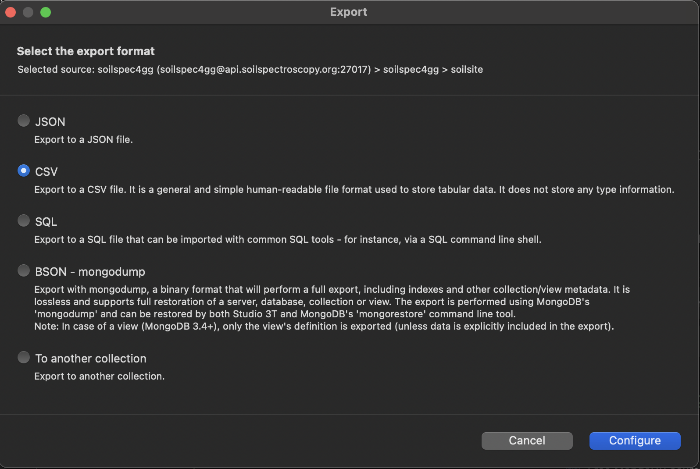
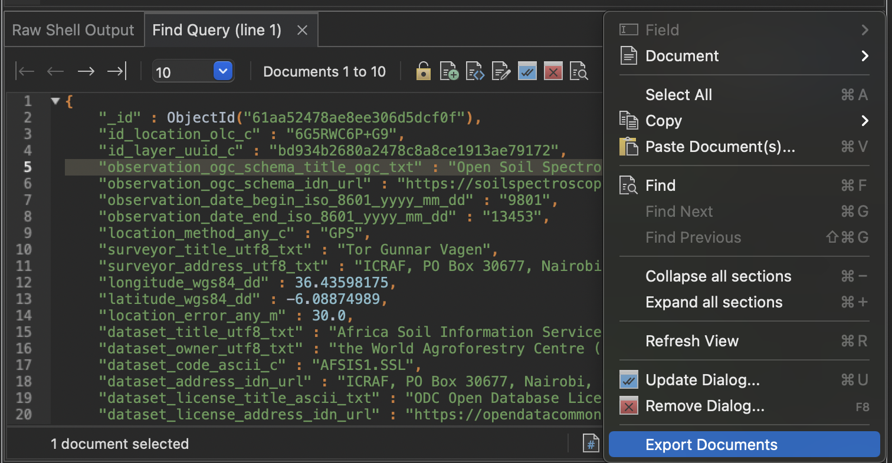

# Start: Exporting the entire OSSL as CSV

- Find the `soilsite` collection in `soispec4gg`:
  

- Left-click on the `soilsite` collection and select `Export`:
  

- Select `CSV` and click `Configure`:
  

- Set the `Export Target` to be the current working directory. For instance, name the file `soilsite.csv`:
  

- `Save`:
  

- Click `Run`:
  

- Results from the export are shown in the console:
  

- The data `soilsite_full.csv` is now exported to the current working directory:
  

# Start: Exporting a Soil Site Sample from the OSSL as CVS

Querying a sample of 10 soil sites from the collection.

- Double click the `soilsite` collection:
  

- Run the entire script (`F5`):
  

- Select 10 soil sites:
  

- Right click anywhere inside the 10 soil site query and select `Export Documents`:
  

- Select `Current Query Result`. Then follow the same steps to select and configure the CSV file described [earlier](#exporting-the-ossl-as-csv):
  
